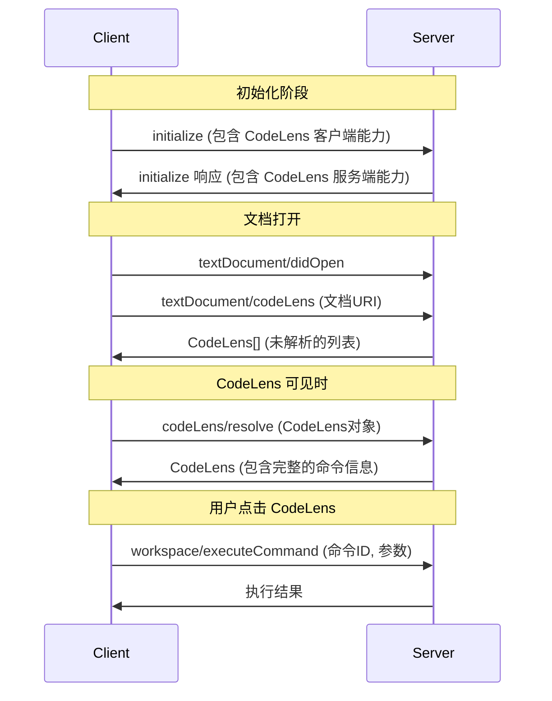

# Language Server Protocol 3.17 - CodeLens 规范

本文档详细描述了 Language Server Protocol (LSP) 3.17 版本中 CodeLens 功能的完整规范，包括客户端与服务端之间的通信协议、数据结构和交互流程。

## 目录

- [概述](#概述)
- [核心概念](#核心概念)
- [数据结构](#数据结构)
- [通信协议](#通信协议)
- [交互流程](#交互流程)
- [能力协商](#能力协商)
- [实现指南](#实现指南)
- [示例](#示例)

## 概述

CodeLens 是一种在源代码编辑器中显示与代码相关信息的可视化元素，通常显示为代码上方或旁边的小图标或文本。常见的 CodeLens 功能包括：

- 显示引用数量
- 提供运行测试的快捷方式
- 显示代码覆盖率信息
- 提供重构操作的入口

LSP 3.17 中的 CodeLens 功能通过两个主要请求实现：
1. `textDocument/codeLens` - 获取 CodeLens 列表
2. `codeLens/resolve` - 解析 CodeLens 的详细信息（可选）

## 核心概念

### CodeLens 生命周期

CodeLens 的处理分为两个阶段：

1. **初始阶段**：客户端请求 CodeLens 列表，服务端返回未解析的 CodeLens 对象
2. **解析阶段**：当 CodeLens 可见或用户交互时，客户端请求解析 CodeLens 的详细信息

这种两阶段设计有助于提高性能，避免一次性计算所有 CodeLens 的详细信息。

### 延迟解析

为了优化性能，CodeLens 支持延迟解析：
- 初始请求只返回基本的结构信息（位置和数据）
- 详细信息（如命令）通过 resolve 请求获取
- 服务端可以选择在初始阶段就返回完整信息

## 数据结构

### CodeLens

```typescript
interface CodeLens {
    /**
     * 此 CodeLens 有效的范围。应只跨越单行。
     */
    range: Range;

    /**
     * 此 CodeLens 代表的命令。
     */
    command?: Command;

    /**
     * 在 CodeLens 和 CodeLens 解析请求之间保留的数据条目字段。
     */
    data?: any;
}
```

### Command

```typescript
interface Command {
    /**
     * 命令的标识符。
     */
    title: string;

    /**
     * 要执行的命令的标识符。
     */
    command?: string;

    /**
     * 执行命令时传递的参数。
     */
    arguments?: any[];
}
```

### Range

```typescript
interface Range {
    /**
     * 范围的起始位置。
     */
    start: Position;

    /**
     * 范围的结束位置。
     */
    end: Position;
}
```

### Position

```typescript
interface Position {
    /**
     * 行号（从 0 开始）。
     */
    line: uinteger;

    /**
     * 字符位置（从 0 开始）。
     */
    character: uinteger;
}
```

## 通信协议

### 1. 客户端能力

```typescript
interface CodeLensClientCapabilities {
    /**
     * CodeLens 是否支持动态注册。
     */
    dynamicRegistration?: boolean;
}
```

### 2. 服务端能力

```typescript
interface CodeLensOptions extends WorkDoneProgressOptions {
    /**
     * CodeLens 是否也具有解析提供程序。
     */
    resolveProvider?: boolean;
}
```

### 3. 注册选项

```typescript
interface CodeLensRegistrationOptions extends
    TextDocumentRegistrationOptions, CodeLensOptions {
}
```

### 4. textDocument/codeLens 请求

**请求**：
- **方法**: `textDocument/codeLens`
- **参数**: `CodeLensParams`

```typescript
interface CodeLensParams extends WorkDoneProgressParams, PartialResultParams {
    /**
     * 要请求 CodeLens 的文档。
     */
    textDocument: TextDocumentIdentifier;
}
```

**响应**：
- **结果**: `CodeLens[]` | `null`
- **部分结果**: `CodeLens[]`

### 5. codeLens/resolve 请求

**请求**：
- **方法**: `codeLens/resolve`
- **参数**: `CodeLens`

**响应**：
- **结果**: `CodeLens`

## 交互流程



## 能力协商

### 客户端声明能力

```json
{
  "capabilities": {
    "textDocument": {
      "codeLens": {
        "dynamicRegistration": true
      }
    }
  }
}
```

### 服务端声明能力

```json
{
  "capabilities": {
    "codeLensProvider": {
      "resolveProvider": true,
      "workDoneProgress": true
    }
  }
}
```

### 动态注册

如果支持动态注册，客户端可以在运行时注册/注销 CodeLens 功能：

**注册请求**：
```json
{
  "method": "client/registerCapability",
  "params": {
    "registrations": [
      {
        "id": "textDocument/codeLens",
        "method": "textDocument/codeLens",
        "registerOptions": {
          "resolveProvider": true,
          "documentSelector": [
            { "language": "typescript" },
            { "language": "javascript" }
          ]
        }
      }
    ]
  }
}
```

## 实现指南

### 客户端实现

1. **能力检测**：在初始化时检查服务端是否支持 CodeLens
2. **请求管理**：管理 CodeLens 请求的生命周期
3. **缓存策略**：实现合适的缓存机制避免重复请求
4. **延迟解析**：实现延迟解析以提高性能
5. **错误处理**：正确处理请求失败和超时情况

### 服务端实现

1. **性能优化**：
   - 使用两阶段解析策略
   - 实现增量更新机制
   - 避免重复计算

2. **数据管理**：
   - 维护 CodeLens 与文档的关联
   - 处理文档变化时的更新
   - 实现 resolve 请求的数据恢复

3. **错误处理**：
   - 处理无效的文档引用
   - 处理解析失败的情况
   - 提供适当的错误信息

### 最佳实践

1. **性能考虑**：
   - 限制单个文档的 CodeLens 数量
   - 使用延迟解析减少初始响应时间
   - 实现适当的缓存策略

2. **用户体验**：
   - 提供 loading 状态指示
   - 处理 CodeLens 的可见性变化
   - 支持键盘导航

3. **兼容性**：
   - 处理能力协商失败的情况
   - 向后兼容旧版本客户端
   - 提供降级策略

## 示例

### 基本请求示例

**客户端请求**：
```json
{
  "jsonrpc": "2.0",
  "id": 1,
  "method": "textDocument/codeLens",
  "params": {
    "textDocument": {
      "uri": "file:///path/to/example.ts"
    }
  }
}
```

**服务端响应**：
```json
{
  "jsonrpc": "2.0",
  "id": 1,
  "result": [
    {
      "range": {
        "start": { "line": 10, "character": 0 },
        "end": { "line": 10, "character": 20 }
      },
      "data": {
        "type": "references",
        "position": { "line": 10, "character": 15 }
      }
    },
    {
      "range": {
        "start": { "line": 20, "character": 0 },
        "end": { "line": 20, "character": 25 }
      },
      "data": {
        "type": "runTest",
        "testId": "test-123"
      }
    }
  ]
}
```

### 解析请求示例

**客户端请求**：
```json
{
  "jsonrpc": "2.0",
  "id": 2,
  "method": "codeLens/resolve",
  "params": {
    "range": {
      "start": { "line": 10, "character": 0 },
      "end": { "line": 10, "character": 20 }
    },
    "data": {
      "type": "references",
      "position": { "line": 10, "character": 15 }
    }
  }
}
```

**服务端响应**：
```json
{
  "jsonrpc": "2.0",
  "id": 2,
  "result": {
    "range": {
      "start": { "line": 10, "character": 0 },
      "end": { "line": 10, "character": 20 }
    },
    "command": {
      "title": "3 references",
      "command": "editor.action.showReferences",
      "arguments": [
        "file:///path/to/example.ts",
        { "line": 10, "character": 15 },
        [
          {
            "uri": "file:///path/to/example.ts",
            "range": {
              "start": { "line": 5, "character": 10 },
              "end": { "line": 5, "character": 15 }
            }
          },
          {
            "uri": "file:///path/to/other.ts",
            "range": {
              "start": { "line": 25, "character": 8 },
              "end": { "line": 25, "character": 13 }
            }
          }
        ]
      ]
    },
    "data": {
      "type": "references",
      "position": { "line": 10, "character": 15 }
    }
  }
}
```

## 错误处理

### 常见错误代码

- `-32800` (`RequestCancelled`): 客户端取消请求
- `-32801` (`ContentModified`): 文档内容已修改
- `-32602` (`InvalidParams`): 请求参数无效
- `-32803` (`RequestFailed`): 请求执行失败

### 错误响应示例

```json
{
  "jsonrpc": "2.0",
  "id": 1,
  "error": {
    "code": -32801,
    "message": "Document content was modified",
    "data": {
      "uri": "file:///path/to/example.ts",
      "version": 5
    }
  }
}
```

## 版本兼容性

### LSP 3.17 新特性

- 改进的类型安全性
- 更好的错误处理机制
- 增强的元模型支持
- 性能优化

### 向后兼容性

- 保持与 LSP 3.15/3.16 的兼容性
- 支持可选字段的安全降级
- 提供能力检测机制

## 总结

LSP 3.17 的 CodeLens 功能提供了强大而灵活的代码信息显示机制。通过合理使用两阶段解析、延迟加载和适当的能力协商，可以实现高性能的用户体验。

本规范为开发者提供了完整的实现指南，包括数据结构、通信协议、交互流程和最佳实践，有助于在各种编辑器和语言服务器中正确实现 CodeLens 功能。
